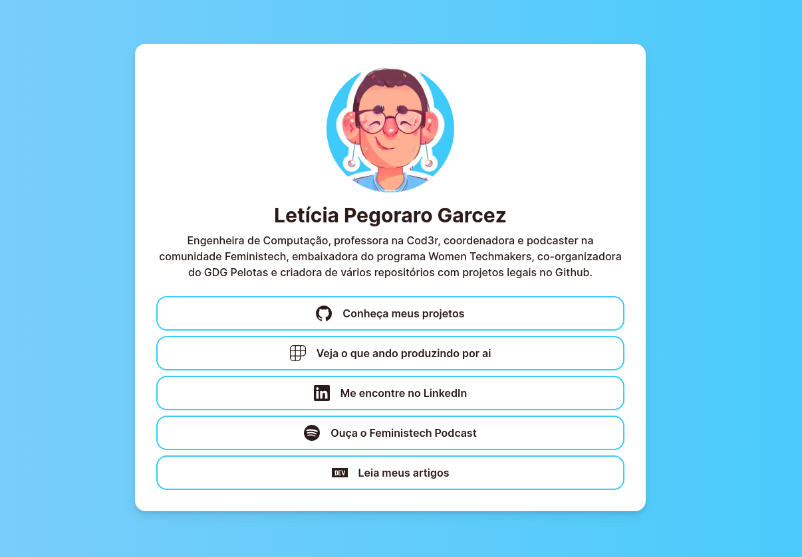

## 🔗 Redes

[Clique aqui para acessar o projeto](https://redes.lelepg.app/)

## 💭 O que é este projeto?

Este projeto é uma aplicação web no estilo linktree para centralizar os links das minhas redes sociais.

## 🖥️ Como rodar este projeto?

Para iniciar a aplicação localmente, é preciso baixar este repositório (seja pelas opções de clone do Github ou através de um arquivo .zip), instalar as dependências com o comando `npm i` e iniciar a aplicação com o comando `npm run dev`. Depois da compilação, o projeto estará disponível localmente através do endereço `localhost:3000`.

_Obs: A porta 3000 é a porta padrão, mas recomendo que você veja em qual porta o projeto realmente será rodado através do terminal onde o comando `npm run dev` foi usado._
